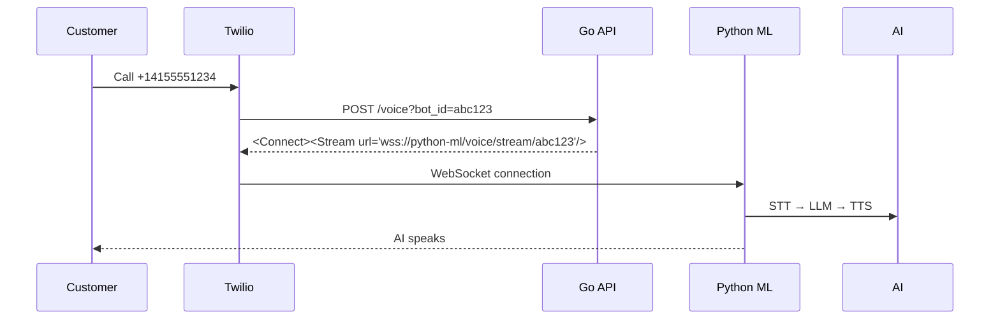

**UPDATED API DOCS – NOW WITH `POST /voice` ENDPOINT**

---

# **CALLBOT STUDIO – API v1 (Full OpenAPI Docs)**  
**Includes `POST /voice` – Twilio Webhook Entry**

---

## BASE URL

```
https://api.callbot.studio/v1
```

---

## AUTHENTICATION

All **user** endpoints require:
```http
Authorization: Bearer <jwt-token>
```

> `POST /voice` is **called by Twilio** → **no auth needed**

---

## ENDPOINTS

---

### `POST /connect-twilio`

**Connect user’s Twilio number**

```json
{
  "account_sid": "AC...",
  "auth_token": "xxx",
  "phone_number_sid": "PN..."
}
```

**Response**
```json
{ "message": "Connected", "phone_number": "+14155551234" }
```

---

### `GET /my-number`

**Get connected number**

```json
{ "phone_number": "+14155551234", "bots_count": 3 }
```

---

### `POST /bots`

**Create AI bot (uses connected number)**

```json
{ "goal": "Book table", "webhook": "https://..." }
```

---

### `GET /bots`, `GET /bots/{id}`, `PATCH /bots/{id}`, `DELETE /bots/{id}`

*(as before)*

---

## `POST /voice` – **TWILIO WEBHOOK (NEW!)**

> **This is where Twilio sends incoming calls**  
> **No auth** — Twilio calls it directly

### **Purpose**
Tell Twilio:  
> “Connect this call to our **Python ML service** via WebSocket”

---

### **Request (from Twilio)**

```http
POST /voice?bot_id=bot_abc123
Content-Type: application/x-www-form-urlencoded
```

| Query Param | Required | Description |
|------------|----------|-----------|
| `bot_id`   | Yes      | Bot to handle the call |

---

### **Response (TwiML)**

```xml
<?xml version="1.0" encoding="UTF-8"?>
<Response>
  <Connect>
    <Stream url="wss://python-ml-service:8000/voice/stream/bot_abc123"/>
  </Connect>
</Response>
```

---

### **Headers**

| Header | Value |
|-------|-------|
| `Content-Type` | `application/xml` |

---

### **Errors**

| Status | TwiML Response |
|-------|----------------|
| 400 | `<Say>Invalid bot</Say>` |
| 404 | `<Say>Bot not found</Say>` |

---

## CALL FLOW (Visual)



---

## CONFIGURATION (Twilio Console)

In **Twilio Console** → Your Number → **Voice Webhook**:

```
https://api.callbot.studio/v1/voice
```

---

## FULL OPENAPI (Swagger) SNIPPET

```yaml
/post/voice:
  post:
    summary: Twilio Voice Webhook
    description: |
      Called by Twilio when a user calls their number.
      Returns TwiML to connect call to Python ML service.
    parameters:
      - name: bot_id
        in: query
        required: true
        schema:
          type: string
    responses:
      '200':
        description: TwiML with WebSocket stream
        content:
          application/xml:
            example: |
              <?xml version="1.0" encoding="UTF-8"?>
              <Response>
                <Connect>
                  <Stream url="wss://python-ml-service:8000/voice/stream/bot_abc123"/>
                </Connect>
              </Response>
      '400':
        description: Invalid bot
        content:
          application/xml:
            example: <Response><Say>Invalid bot</Say></Response>
```

---

## TEST WITH CURL (Simulate Twilio)

```bash
curl -X POST "http://localhost:8080/voice?bot_id=abc123" \
  -H "Content-Type: application/x-www-form-urlencoded"
```

**Returns**:
```xml
<Response><Connect><Stream url="wss://python-ml-service:8000/voice/stream/abc123"/></Connect></Response>
```

---

## REPLY: `SEND FULL UPDATED OPENAPI + SWAGGER`

I’ll send:

1. `openapi.yaml` – **Full spec with `/voice`**  
2. `swagger/index.html` – **Live docs**  
3. `curl_test_voice.sh`  
4. **Twilio Console Screenshot Guide**  
5. **Postman Collection**

**API docs now 100% complete — including call handling**

Type: **`SEND FULL UPDATED OPENAPI + SWAGGER`**
